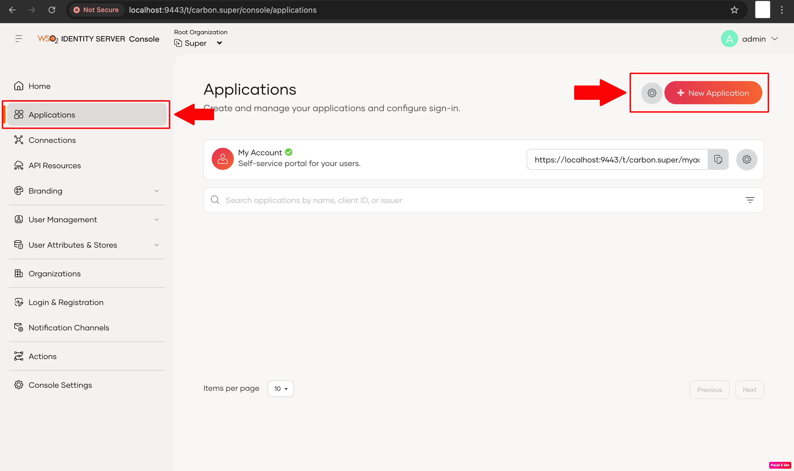
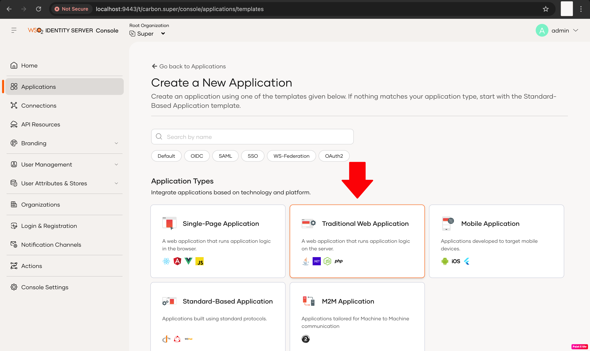
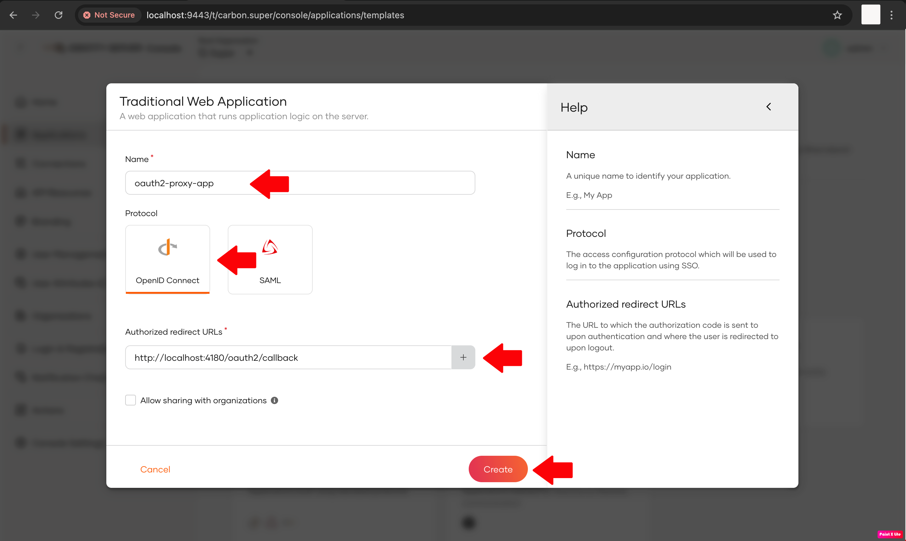
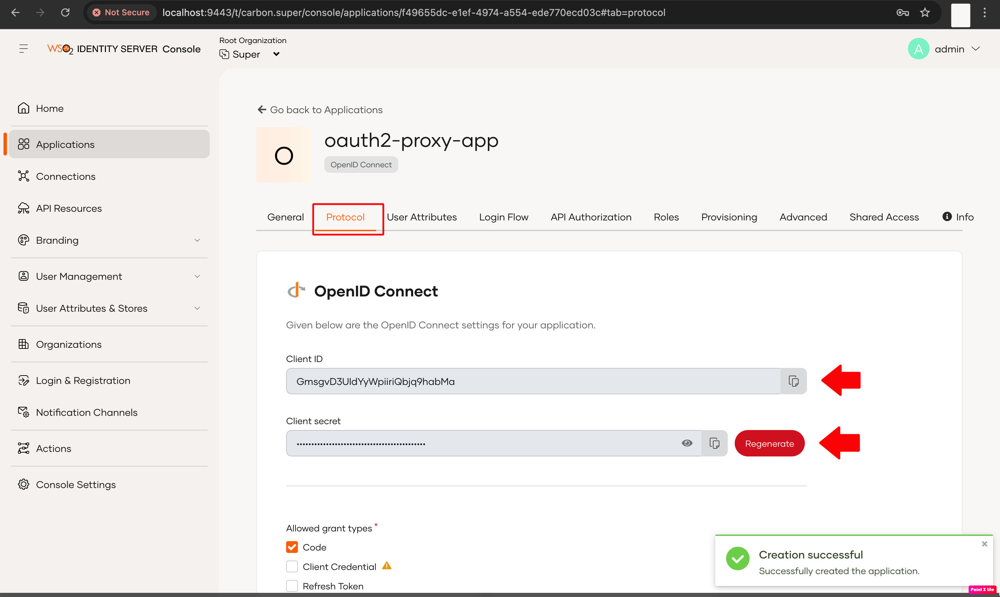
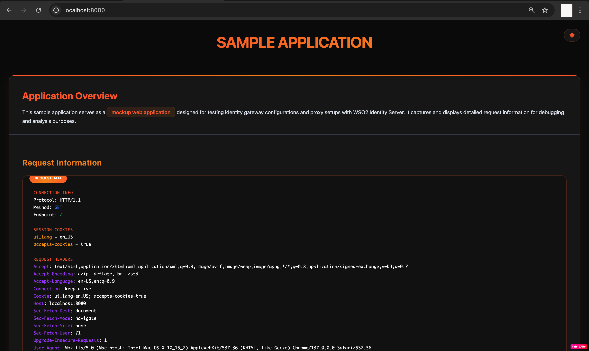

# Setup Guide: Integrating OAuth2 Proxy with WSO2 Identity Server

## Introduction

This guide explains how to secure legacy or non-OIDC applications using [OAuth2 Proxy](https://oauth2-proxy.github.io/oauth2-proxy/) in front of your app, with [WSO2 Identity Server (WSO2 IS)](https://wso2.com/identity-and-access-management/) as the Identity Provider (IdP). This approach allows you to add modern authentication to apps without changing their code.

---

## Prerequisites

- **WSO2 Identity Server** (v7.0.0 or later recommended)
- **OAuth2 Proxy** (latest version)
- **Go** (for installing OAuth2 Proxy via Go)
- **A backend application** (sample Java app or your own)
- **(Optional) Redis** (for advanced session storage)

---

## 1. What is OAuth2 Proxy?

OAuth2 Proxy is an open-source reverse proxy that authenticates users via an external OAuth2 provider (like WSO2 IS) and forwards identity information to your backend app via HTTP headers.

**Why use it?**
- Add OAuth2/OIDC authentication to legacy apps without code changes
- Centralize authentication logic
- Forward user identity (e.g., username, email) as headers


## 2. Setup Steps

### 2.1 Install and Start WSO2 Identity Server

1. **Download WSO2 IS:**
   - [Get the latest version](https://is.docs.wso2.com/en/7.0.0/get-started/quick-set-up/)
2. **Extract the archive:**
   ```sh
   unzip wso2is-<version>.zip
   # Replace <version> with your downloaded version, e.g., wso2is-7.0.0
   ```
3. **Start the server:**
   ```sh
   cd path/to/wso2is-<version>/bin
   ./wso2server.sh   # On Linux/macOS
   wso2server.bat    # On Windows
   ```
4. **Create an OIDC Application:**
   - Go to [https://localhost:9443/console](https://localhost:9443/console)
   - Login (default: `admin` / `admin`)
   - Navigate to **Applications → Add Application**
   
   - Select **Traditional Web Application**
     
   - Fill in:
     - **Name:** `oauth2-proxy-app`
     - **Callback URL:** `http://localhost:4180/oauth2/callback` (or your proxy callback URL)
       
   - Save and copy the generated **Client ID** and **Client Secret**
     

---

### 2.2 Set Up Your Backend

If you don’t have a backend, you can use the sample Java app:
download [here]

```sh
cd path/to/app/folder
java -jar request-logger-Sample-application.jar
```


- Visit [http://localhost:8080](http://localhost:8080) to verify it’s running.

---

### 2.3 Install and Configure OAuth2 Proxy

1. **Install Go:**
   - [Official Go installation guide](https://go.dev/doc/install)
2. **Install OAuth2 Proxy:**
   ```sh
   go install github.com/oauth2-proxy/oauth2-proxy/v7@latest
   ```
   - [OAuth2 Proxy Installation Guide](https://oauth2-proxy.github.io/oauth2-proxy/docs/configuration/overview/)
3. **Create Configuration File:**
   Create a file named `oauth2-proxy.cfg` with the following content:

   ```ini
   provider = "oidc"
   oidc_issuer_url = "https://localhost:9443/oauth2/token"
   oidc_jwks_url = "https://localhost:9443/oauth2/jwks"
   redirect_url = "http://localhost:4180/oauth2/callback"

   client_id = "<your_client_id>"
   client_secret = "<your_client_secret>"

   email_domains = ["*"]
   scope = "openid email profile"

   set_xauthrequest = true
   skip_auth_preflight = false
   http_address = "127.0.0.1:4180"
   upstreams = ["http://localhost:8080"]

   pass_access_token = true
   pass_user_headers = true
   set_authorization_header = true
   code_challenge_method = "S256"
   user_id_claim = "username"

   cookie_secure = false
   cookie_samesite = "lax"
   cookie_csrf_per_request = false
   cookie_secret = "<your_32_byte_base64_secret>"
   ```
   **Note:**
   - Replace `<your_client_id>`, `<your_client_secret>`, and `<your_32_byte_base64_secret>` with your actual values.
   - The `cookie_secret` must be a base64-encoded 32-byte string.

4. **Run OAuth2 Proxy:**
   - **As a binary:**
     ```sh
     oauth2-proxy --config=/path/to/oauth2-proxy.cfg
     ```
   - **Via Docker:**
     ```sh
     docker run -p 4180:4180 \
       -v $(pwd)/oauth2-proxy.cfg:/etc/oauth2-proxy.cfg \
       quay.io/oauth2-proxy/oauth2-proxy:latest \
       --config /etc/oauth2-proxy.cfg
     ```

5. **Access Your Application:**
   - Visit [http://localhost:4180/home](http://localhost:4180/home)
   - You’ll be redirected to the WSO2 IS login page. After login, OAuth2 Proxy forwards identity headers (e.g., `X-Forwarded-User`, `X-Forwarded-Email`) to your backend.
   - These can then be consumed by your upstream app.
   

---

## 3. Advanced Configurations

### 3.1 Use Redis for Session Storage

Add to your `oauth2-proxy.cfg`:

```ini
session_store_type = "redis"
redis_connection_url = "redis://127.0.0.1:6379/1"
```
- Format: `redis://[:password@]host[:port][/db-number]`

### 3.2 Enable TLS for OAuth2 Proxy

Add to your `oauth2-proxy.cfg`:

```ini
http_address = "0.0.0.0:443"
cookie_secure = true
tls_cert_file = "/path/to/cert.pem"
tls_key_file = "/path/to/cert.key"
tls_min_version = "TLS1.3"  # Optional, for stronger security
```

### 3.3 Generate a Self-Signed TLS Certificate (Development Only)

```sh
openssl req -x509 -newkey rsa:2048 -nodes \
  -keyout /path/to/cert.key \
  -out /path/to/cert.pem \
  -days 365 \
  -subj "/CN=localhost"
```
- For production, use a certificate from a trusted CA (e.g., Let’s Encrypt).

---

## Final Notes

Integrating OAuth2 Proxy with WSO2 IS provides a modern, standards-based solution to secure apps that:
- Lack native OIDC support
- Were built with custom or insecure authentication
- Require centralized authentication logic

This setup is ideal for dashboards, microservices, and legacy apps—making your stack secure, scalable, and maintainable.